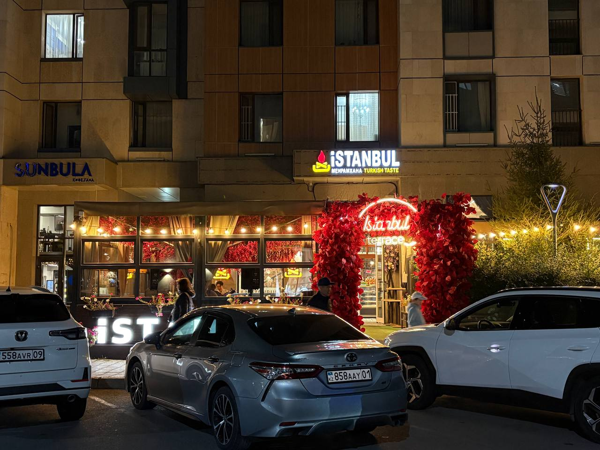

# Istanbul Restaurant Website



An eight-page website about **Istanbul Turkish Taste**, Uly Dala Avenue 56, Astana. Sanzhar, Jasulan and Madi continue the same Introduction to Web Technologies project for the midterm.

## Pages and team

| Page | Purpose | Main owner |
| --- | --- | --- |
| `index.html` | Restaurant introduction, hours, guest reviews and next steps | Shared |
| `menu.html` | 18 published menu prices, dish/portion selection and meal planning | Sanzhar |
| `visit.html` | Address, hours, directions, contacts and visit preparation | Jasulan |
| `gallery.html` | Existing restaurant photographs with captions and alt text | Jasulan |
| `about.html` | Restaurant information, services and identity | Madi |
| `faq.html` | Visitor answers and question preparation | Madi |
| `feedback.html` | Review guidance and review preparation | Sanzhar |
| `colophon.html` | Team responsibilities and explanation of the site | Shared |

Every page has the same navigation and footer. The header has seven visitor-page links; Colophon remains available from the footer on every page. Titles follow `Page — Istanbul Restaurant Astana`.

## Three visitor journeys

### 1. Find the address and opening hours

- **Start:** Home.
- **Steps:** open Visit from navigation; choose **See address**; read the restaurant details table.
- **End:** find Uly Dala Avenue 56, daily hours 08:00–02:00 and the phone number. The map link is optional; no booking or staff approval is required to complete this journey.

### 2. Compare dishes and prepare a visit

- **Start:** Menu.
- **Steps:** compare Turkish menemen (1,900 ₸) and gözleme (2,400 ₸); choose **Plan a meal**; select a dish and portions; choose **Check meal choices**; read the result; choose **Plan your visit**; complete the visit details and acknowledgment; choose **Check visit details**.
- **End:** the visit result confirms that the required fields passed browser checks, explains that no reservation was made, and offers **Review address and hours** or **Start again**. One visitor completes this path alone. Calling for a reservation is optional and outside this preparation journey.
- **Current boundary:** meal selection and confirmation are built; automatic subtotal calculation is reserved for the JavaScript assignments. The output starts at “No estimate yet” and never claims a calculated amount. Submitted values are not retained in the form after navigation.

### 3. Learn about the restaurant and prepare a question

- **Start:** About.
- **Steps:** read the restaurant information; choose **Prepare a question**; read the FAQ; complete the question form and acknowledgment; choose **Check question**.
- **End:** the question result explains that the required entries were checked and the question was not sent or saved. The visitor can return to the answers or start again. Opening WhatsApp is optional and outside the completed local journey.

Feedback also has a complete preparation flow: required fields → **Check review** → visible result → recovery or optional public-review link.

## Form behavior at the midterm

There is no custom website JavaScript, server or database. Native HTML validation checks required fields, email format and number ranges. Each GET form targets an existing result section; CSS `:target` reveals its prepared confirmation. Form values appear in the browser URL during submission; no application stores them or sends them to the restaurant. The static result is not a receipt, reservation or published review, and does not reproduce or retain entered values. The interface states these boundaries before submission and in the result.

Future JavaScript will calculate the subtotal, populate the prepared summary/error containers, preserve values locally where appropriate and toggle existing state classes. No staff accounts, approval chains or pretend restaurant backend are included.

## JavaScript-ready markup

| Surface | Existing hooks |
| --- | --- |
| Navigation | `navigation-toggle`, `main-navbar`, `navigation-links` |
| Menu | `menu-items`, `generated-menu-items`, `dish-*`, `category-*`, `menu-meal-form`, `menu-dish`, `menu-quantity`, `menu-total` |
| Visit | `visit-plan-form`, `visit-*` inputs, `visit-form-result` |
| Question | `faq-question-form`, `faq-*` inputs, `question-result`, `faq-items`, `generated-faq-items` |
| Review | `feedback-review-form`, `feedback-*` inputs, `feedback-result` |
| Generated content | `generated-gallery-items`, `gallery-empty`, `guest-reviews`, `generated-reviews` |
| Every form | `<page>-submit`, `<page>-reset`, `<page>-errors`, `<page>-summary`, `<page>-confirmation`, per-field `<input-id>-error` containers |

Ids use English lowercase kebab-case. Shared states are `.is-hidden`, `.is-active`, `.is-selected`, `.is-error`, `.is-success`, `.field-error` and the result-panel states. Error containers have `role="alert"`; results have `role="status"`; generated confirmations have `aria-live="polite"`. Inputs have real labels. The existing local `.faq-stepss` styling and sticky header are retained.

## Stack and opening the site

- Semantic HTML5 and native browser validation.
- Bootstrap **5.3.8**, locally pinned in `vendor/bootstrap/`; original CSS and bundle SRI hashes verified. Bootstrap supplies responsive grid, utilities, controls and mobile menu behavior.
- `css/base.css`: a small shared correction layer for palette, fonts, images, focus, sticky header and prepared states.
- Existing local JPG photographs in `images/`; no new stock or generated images.
- No build step or custom runtime scripts.

Open `index.html` directly, or start a local server from this directory:

```powershell
python -m http.server 4173 --bind 127.0.0.1
```

Then visit `http://127.0.0.1:4173/index.html`. Bootstrap assets and images load locally.

## Submission and structure freeze

The team must complete cross-review at least two days before the actual deadline, confirm content and photograph ownership, and commit from each member's own account on at least four different days. Technical checks do not replace team review. No deadline was supplied and the required histories have not been certified.

After all findings are fixed and the team approves the final structure, create the final commit and tag it:

```powershell
git add .
git commit -m "Finish midterm HTML and CSS"
git tag -a midterm -m "Freeze midterm HTML and CSS"
git push feruum master:main
git push feruum midterm
```

The tag has deliberately **not** been created during preparation. After `midterm`, new elements and styles must be produced through JavaScript under the assignment's freeze rule. Before pushing, review the diff and remote branch; this checkout is `master` tracking `feruum/main`.

At defense, each member should explain a page they did not write, the prepared hooks/states, semantic elements, validation and Bootstrap layout choices.

